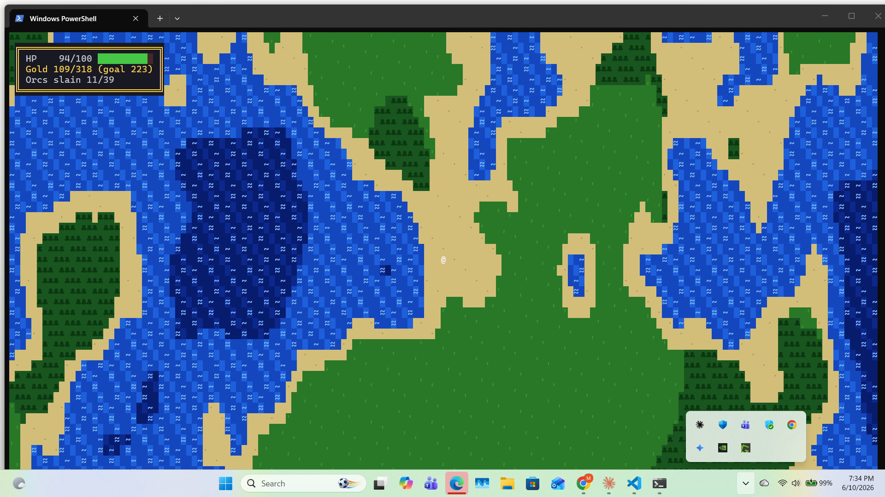
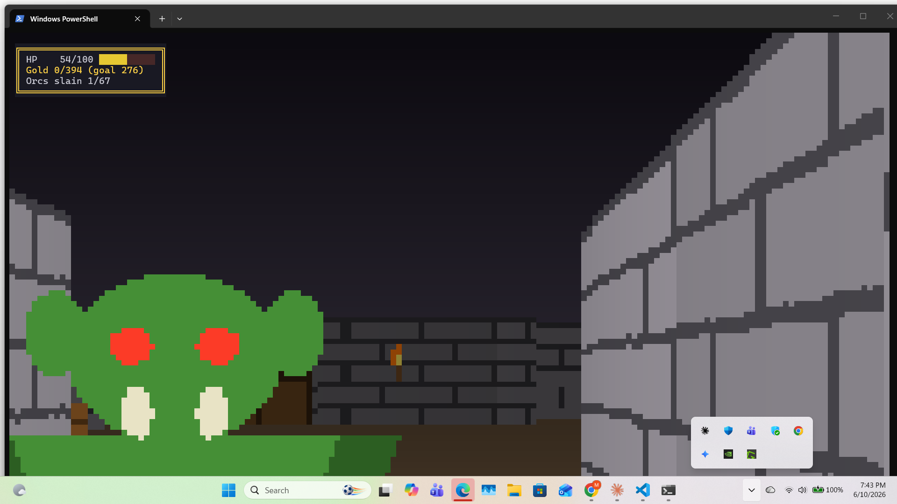
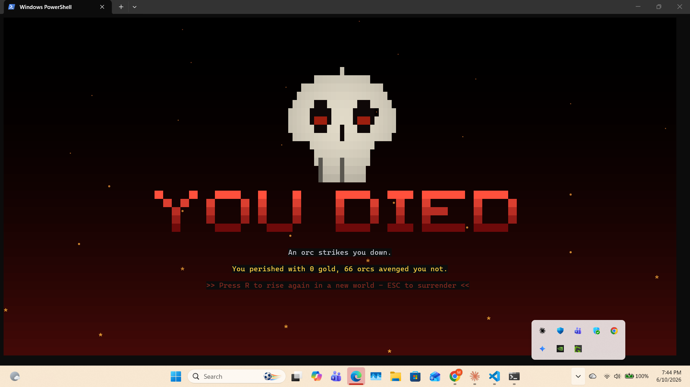

# DungeonGame

A terminal adventure game in Go with two modes:

- **World mode** — an Ultima-style top-down scroller over a generated 256×256
  island continent ringed by open sea: animated water and lava, forests,
  mountains, warning signs, and three healer buildings (DOCTOR, PUB, INN)
  scattered across the land, their names inset in their walls.
- **Dungeon mode** — a first-person raycaster. 3–5 dungeons hide in the
  forests and mountains, each with 6–12 rooms joined by corridors, doors that
  creak open, columns, wall torches, treasure chests, prowling orcs, skeleton
  archers, and entry and exit ladders back to the surface.

## Screenshots

Exploring the island continent — animated coastline, forests, and the quest
tally in the stats box:



Deep in a dungeon, an orc closes in by torchlight:



It does not always end well:



## Installing

With [Go](https://go.dev/dl/) installed (macOS, Linux, or Windows):

```
go install github.com/mjmurphy3/DungeonGame@latest
```

That drops a `DungeonGame` binary into `$HOME/go/bin` (add it to your PATH if
it isn't already — on macOS: `export PATH="$HOME/go/bin:$PATH"`). Then just
run `DungeonGame` from anywhere.

## Running from source

```
go run .
```

Optional: `go run . -seed 12345` for a reproducible world.

The game adapts live to your terminal's size — **maximize the window for the
best view**. For the biggest, sharpest picture, set your terminal profile to
a small fixed-width font (e.g. Cascadia Mono at 8–10 pt): more columns means
more raycaster resolution.

> Upgrading from an older version? Earlier builds asked Windows Terminal for
> a fixed 256-column grid, which can stay stuck to the tab and render the
> game off-center. Resize the window once (or open a fresh tab) and it's
> cured for good.

## Controls

| Key   | World mode            | Dungeon mode            |
|-------|-----------------------|-------------------------|
| ENTER | start (title screen)  |                         |
| W / S | walk north / south    | walk forward / back     |
| A / D | walk west / east      | turn left / right       |
| Arrows| same as WASD          | same as WASD            |
| Q / E |                       | strafe left / right     |
| SPACE | (fizzles)             | fire magic missile      |
| R     | restart after death/victory | restart after death/victory |
| ESC   | quit                  | quit                    |

## Rules of the realm

- You start with **100 HP** and heal **1 HP every 20 seconds**, always.
- Your magic missile deals **1–10** damage; monsters have **20 HP**.
- **Orcs** must get adjacent to strike, and claw you for **1–4**.
- **Skeleton archers** keep their distance and shoot bone arrows for **1–10**.
- If something hits you from outside your view, a flashing **⚠ LOOK AROUND!**
  appears in the top-right corner — heed it.
- Lava burns for **10 HP per tile** — heed the warning signs.
- Every treasure chest holds gold **and restores +5 HP**.
- The **DOCTOR** heals up to **+40**, the **PUB** and **INN** **+10** each —
  once per visit, with a 5-minute rest before they'll treat you again.
- Step onto either ladder in a dungeon to climb out; you emerge just outside
  the entrance you used.
- **Winning:** claim **70% of all the gold** hidden in the world's chests, or
  **slay every foe**. The bordered stats box (top-left) tracks your HP, gold
  against the goal, and foes slain; victory earns you a sunrise.

## Development

```
go test ./...     # generation invariants, combat bounds, regen timing
go vet ./...
```
